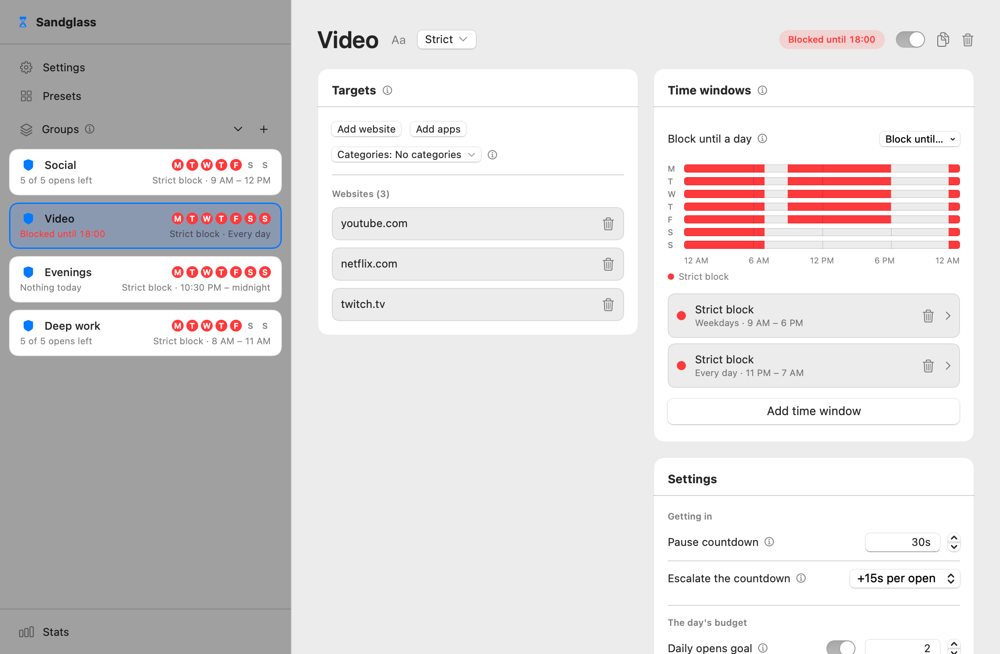
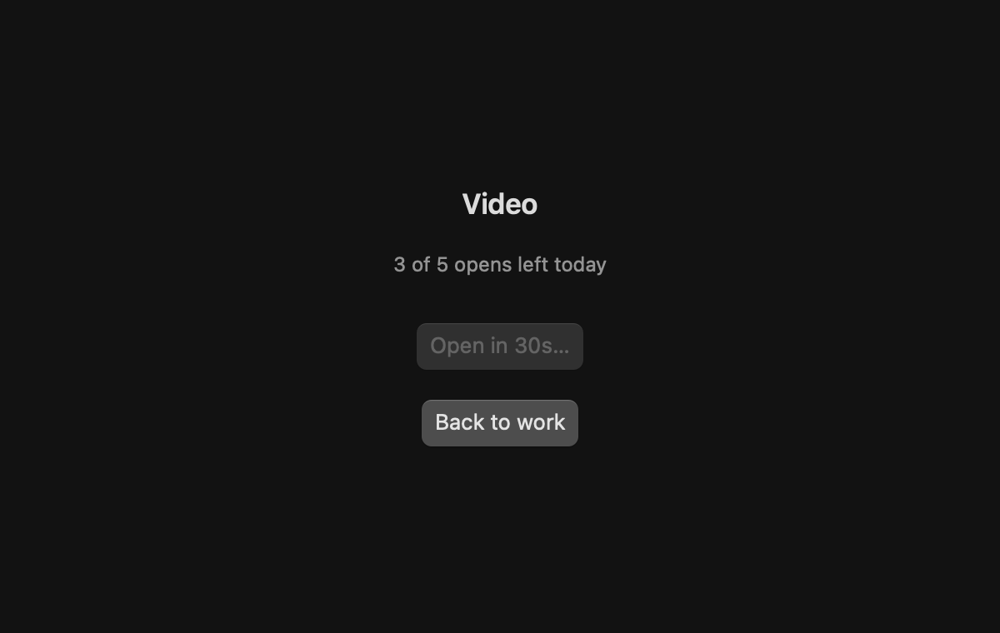
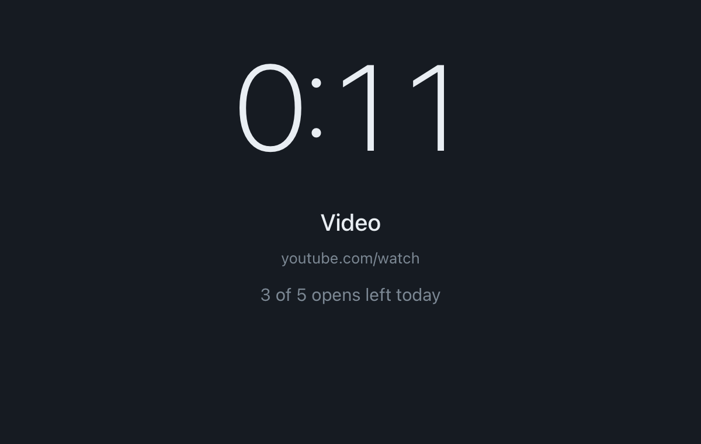
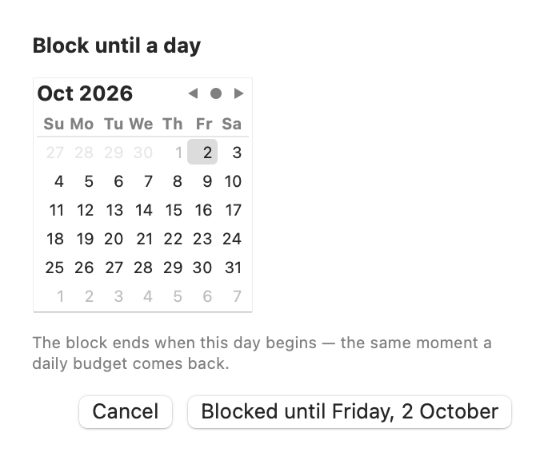
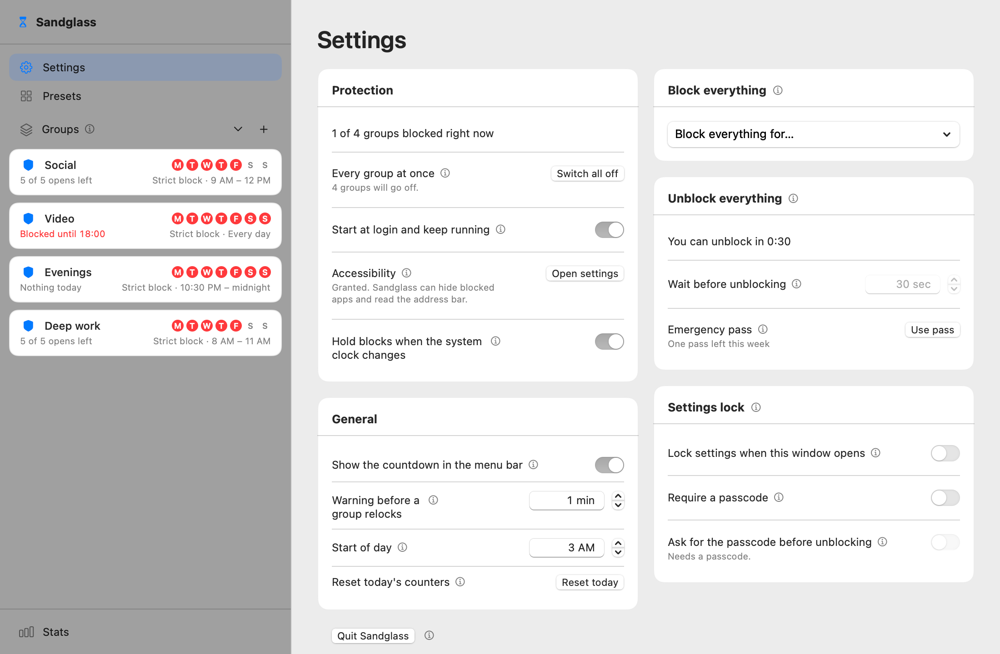

<div align="center">

# Sandglass

**A calm app and website blocker for the Mac: friction you chose, not a warden.**

[](https://github.com/moritzthln/sandglass/actions/workflows/ci.yml)


[](LICENSE)

<picture>
  <source media="(prefers-color-scheme: dark)" srcset="assets/hero-dark.png">
  
</picture>

</div>

Sandglass lives in the menu bar. You put apps and websites into groups, give each group a
budget and the hours it is off-limits, and Sandglass puts a short, deliberate pause between you
and the thing you reach for out of habit. Everything stays on your Mac.

## Why Sandglass

- **Friction you chose, not a warden.** A pause, a daily budget of opens, a block during the
  hours you picked. Nothing scolds you, nothing keeps score in red.
- **A screen only when there is a button on it.** If there is a way through, you get a countdown
  and an Open button. If there isn't, the app simply goes away. No notice to dismiss.
- **Apps are hidden, never quit.** Your unsaved work is safe. A blocked app is sent to the
  background, out of fullscreen if it has to be, and stays there.
- **Websites go to a local block page.** Only the tab is redirected, to a page that ships inside
  the app. No proxy, no browser extension, no network traffic.
- **Locks hold loosening; tightening is always allowed.** A settings lock or passcode stops you
  from weakening your rules at 23:40. Adding a site or a longer pause always goes through.
- **Everything on-device.** No account, no analytics, no server.

## A tour

### Groups and time windows

A group is a set of apps and websites that share one budget: how long the pause is, how many
opens a day, how long a session lasts before it locks again. Time windows mark the hours a group
is blocked outright (strict block) or completely free (break), drawn across the week so you can
see it at a glance.

### The pause screen



Opening a blocked app shows a dark, still screen with a countdown. When it runs out you may open
the app, which spends one of the day's opens. "Back to work" is always there and never moves.

### The block page



A blocked website gets the same countdown in the tab itself. When the wait is over, the Open
button is an ordinary link back to the page you wanted. Other tabs are untouched.

### Block until a day



Shut a group until a date, for a week of exams or a holiday. The block ends when that day begins.

### Settings and locks



Block everything for a while, take an unblock that waits first, use the weekly emergency pass,
or lock the settings behind a timer or a passcode.

## Install

### With Homebrew

```sh
brew install --cask moritzthln/tap/sandglass
```

The cask removes the quarantine flag for you, so Gatekeeper does not stop the first launch.
Continue with **Accessibility** and **Automation** below (steps 4 and 5).

### By hand

1. **Download** `Sandglass-<version>.zip` from the
   [latest release](https://github.com/moritzthln/sandglass/releases/latest) and unzip it.
2. **Drag `Sandglass.app` to `/Applications`.**
3. **Open it the first time.** Sandglass is ad-hoc signed, not notarized (there is no paid
   Apple Developer ID behind it), so Gatekeeper stops the first launch:
   - **macOS 14 Sonoma:** right-click (or Control-click) `Sandglass.app` in Finder, choose
     **Open**, then **Open** again in the dialog.
   - **macOS 15 Sequoia and later:** double-click it once and dismiss the warning. Then open
     **System Settings → Privacy & Security**, scroll to the message about Sandglass and click
     **Open Anyway**, then confirm.
   - **Either version, from Terminal:** remove the quarantine flag instead:
     ```sh
     xattr -dr com.apple.quarantine /Applications/Sandglass.app
     ```
4. **Grant Accessibility.** Sandglass asks for it when you open its window; the switch is in
   **System Settings → Privacy & Security → Accessibility**. It is needed to take a blocked app
   out of fullscreen (a plain hide does nothing to an app in its own Space) and to read the
   address bar in Firefox.
5. **Allow Automation once per browser.** The first time Sandglass reads a browser's address,
   macOS asks whether Sandglass may control that browser. Allow it: that is how Sandglass knows
   which page is in front and how it sends a blocked tab to the block page.

Sandglass starts at login and comes back within seconds if it is quit; you can turn that off in
Settings → Protection.

## Updating

- **Homebrew:** `brew upgrade --cask sandglass`.
- **By hand:** replace `/Applications/Sandglass.app` with the new version, then choose **Quit**
  on Sandglass's Settings page. The start-at-login agent brings the new version up within
  seconds.

Because Sandglass is ad-hoc signed, macOS treats every new version as a new app: after each
update, open **System Settings → Privacy & Security → Accessibility**, remove the old Sandglass
entry with **−** and add the new one with **+**.

To hear about new versions, use **Watch → Custom → Releases** on the GitHub repository.

## Supported browsers

| Browser | Reads the page | Blocked tab goes to |
|---|---|---|
| Safari | AppleScript | the block page |
| Chrome | AppleScript | the block page |
| Arc | AppleScript | the block page |
| Brave | AppleScript | the block page |
| Edge | AppleScript | the block page |
| Firefox | Accessibility | the pause screen over the window (Firefox cannot be steered) |

Other browsers are not read; block them as apps if you need to.

## Build from source

Requirements: macOS 14 or later and the Xcode Command Line Tools (`xcode-select --install`).
A full Xcode works too.

```sh
git clone https://github.com/moritzthln/sandglass.git
cd sandglass/mac
swift run SandglassTests          # the test suite, a few seconds
scripts/build-app.sh              # universal mac/build/Sandglass.app, ad-hoc signed
scripts/install.sh                # build, then replace /Applications/Sandglass.app and start it
```

`build-app.sh` pins the toolchain to the Command Line Tools when they are present
(`DEVELOPER_DIR` overrides it) and produces one binary for both Apple Silicon and Intel.
`scripts/release.sh` builds the release zip and prints its SHA-256.

## How it works

- **Apps.** Sandglass watches which app becomes active and, once a second, which blocked apps
  are still on screen. A blocked app is hidden through a ladder of increasingly firm steps:
  hide, then leave fullscreen via Accessibility, then the fullscreen shortcut, but only for an
  app that is in front and demonstrably stuck. Nothing is ever terminated.
- **Websites.** Once a second it asks the frontmost browser for the address of its active tab.
  A blocked page is replaced by `block.html` from inside the app bundle, with the target, the
  wait and the way back in the query string.
- **Staying alive.** A launchd agent in `~/Library/LaunchAgents` with `KeepAlive` starts
  Sandglass at login and restarts it within seconds of a quit. Quitting from Settings offers to
  turn it off.

## Privacy

Nothing leaves your Mac. There is no network code in Sandglass.

Your data is two JSON files and one log, in `~/Library/Application Support/Sandglass/`:

- `config.json`: your groups, time windows and settings
- `state.json`: today's counters, running sessions and breaks
- `events.jsonl`: a local history of opens, used for the Stats page

When you add a website, Sandglass can suggest sites from your browsers' local history. It reads
the history files on your Mac and nothing more. Safari's history is behind
**Full Disk Access**, which Sandglass never asks for; without it, Safari simply contributes no
suggestions.

## Uninstall

With Homebrew, `brew uninstall --cask sandglass` stops the agent and removes the app;
add `--zap` to delete your settings and history as well.

By hand, remove the agent first, otherwise launchd starts the app again within seconds:

```sh
launchctl bootout gui/$(id -u)/io.github.moritzthln.sandglass.agent
rm -f ~/Library/LaunchAgents/io.github.moritzthln.sandglass.agent.plist
rm -rf /Applications/Sandglass.app
rm -rf ~/Library/Application\ Support/Sandglass    # your settings and history
```

Then remove Sandglass from **System Settings → Privacy & Security → Accessibility** and
**Automation**.

## FAQ

**Why hide apps instead of quitting them?**
Quitting throws away unsaved work and teaches you to fight the blocker. Hiding is reversible,
safe, and enough: the point is the pause, not punishment.

**Can I get around it?**
Yes, with effort, and that is by design. You can quit it from the menu, turn off the agent,
revoke Accessibility, or run `launchctl bootout`. Sandglass adds friction to the impulsive
route; it does not try to win against a determined administrator of their own Mac. (Revoking
Accessibility during a hard block makes things stricter, not looser: the affected apps and
browsers are hidden whole until the permission is back.)

**Why does it need Accessibility?**
To get blocked apps out of fullscreen Spaces, where a normal hide has no effect, and to read the
address bar in Firefox. Sandglass does not record keystrokes or read window contents.

**Does it run on Intel Macs?**
Yes. Every build is universal (`arm64` and `x86_64`) and needs macOS 14 or later.

**Why doesn't Safari suggest any websites?**
Safari keeps its history behind Full Disk Access. Grant it in System Settings if you want
Safari's history in the suggestions; blocking Safari works without it.

## Contributing

Issues and pull requests are welcome. See [CONTRIBUTING.md](CONTRIBUTING.md) for how the code is
organised and how changes are tested.

## Versioning

Sandglass follows [Semantic Versioning](https://semver.org). Changes are listed in
[CHANGELOG.md](CHANGELOG.md).

## License

[MIT](LICENSE) © Moritz Thelen
